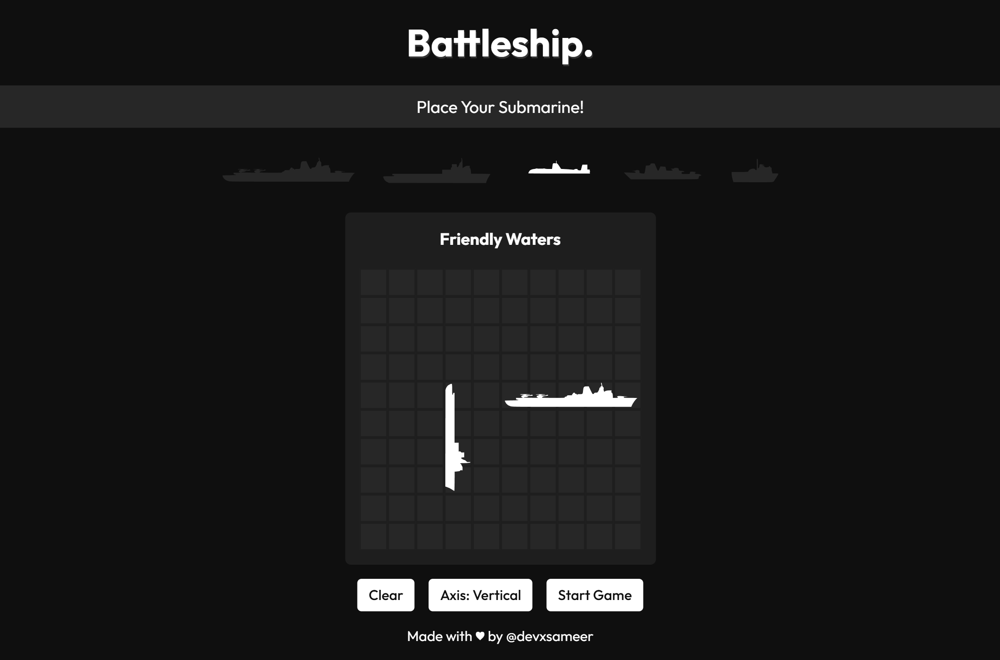
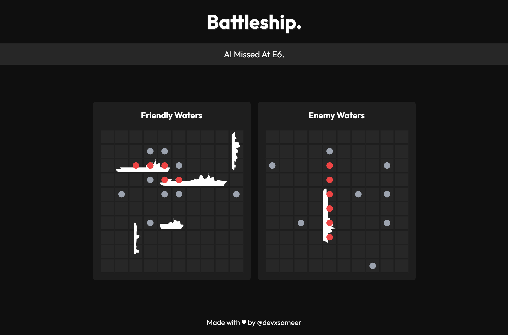

# 🚢 Battleship — The Odin Project

A full implementation of the **Battleship** game from [The Odin Project](https://www.theodinproject.com/), built with **JavaScript, Webpack, and Test-Driven Development (TDD)**.

Challenge your wits against a computer AI, place your fleet strategically, and sink your opponent’s ships before they sink yours!

---

## ✨ Features

- 🧪 **TDD-driven**: Core logic (Ship, GameBoard, Player) fully tested with Jest.
- 🎮 **Gameplay**:
  - Human vs Computer (AI with simple target-seeking strategy).
  - Place ships manually (hover preview).
  - Tracks **hits, misses, sunk ships** with clear UI updates.
- ♿ **Accessibility**:
  - `aria-labels` for cells.
  - Keyboard navigation supported (`tab` + `enter`).
- 🎨 **UI/UX**:
  - Animated status messages via `typed.js`.
  - Hover previews for ship placement.
  - Restart & reset controls.

---

## 📸 Screenshots





## 🛠️ Tech Stack

- **JavaScript (ES6+)**
- **Webpack 5** (dev + prod configs)
- **Jest** for testing
- **Babel** (for ES6 compatibility)
- **CSS / HTML** for layout
- **typed.js** for animated game messages

---

## 📂 Project Structure

```
battleship
├─ README.md
├─ babel.config.js
├─ package-lock.json
├─ package.json
├─ public
│  ├─ images
│  │  ├─ sc_first.png
│  │  └─ sc_second.png
│  └─ index.html
├─ src
│  ├─ Render.js
│  ├─ UI.js
│  ├─ assets
│  │  ├─ fonts
│  │  │  ├─ Outfit-VariableFont_wght.woff
│  │  │  └─ Outfit-VariableFont_wght.woff2
│  │  └─ images
│  │     ├─ battleshipX.svg
│  │     ├─ carrierX.svg
│  │     ├─ destroyerX.svg
│  │     ├─ patrolBoatX.svg
│  │     └─ submarineX.svg
│  ├─ css
│  │  ├─ fonts.css
│  │  ├─ gameBoard.css
│  │  ├─ main.css
│  │  ├─ popup.css
│  │  └─ reset.css
│  ├─ index.js
│  ├─ modules
│  │  ├─ constants.js
│  │  ├─ gameBoard.js
│  │  ├─ player.js
│  │  └─ ship.js
│  └─ tests
│     ├─ gameBoard.test.js
│     ├─ player.test.js
│     └─ ship.test.js
├─ webpack.common.js
├─ webpack.dev.js
└─ webpack.prod.js

```

---

## 🚀 Getting Started

### 1. Clone & install

```bash
git clone https://github.com/devxsameer/battleship.git
cd battleship
npm install
```

### 2. Run locally (dev server)

```bash
npm run dev
```

- This will start a local dev server (via Webpack) and open the game in your browser.

### 3. Build for production

```bash
npm run build
```

- Outputs optimized files into /dist.

---

### 🧪 Running Tests

This project was built with TDD. Tests cover ships, boards, players, attack logic, and AI behaviors.

Run all tests:

```bash

npm run test
```

Run in watch mode (during dev):

```bash
npm run test:watch
```

Generate coverage report:

```bash
npx jest --coverage
```

---

This project is part of [The Odin Project Curriculum](https://www.theodinproject.com/).

Built with ❤️ by `Sameer Ali`.
